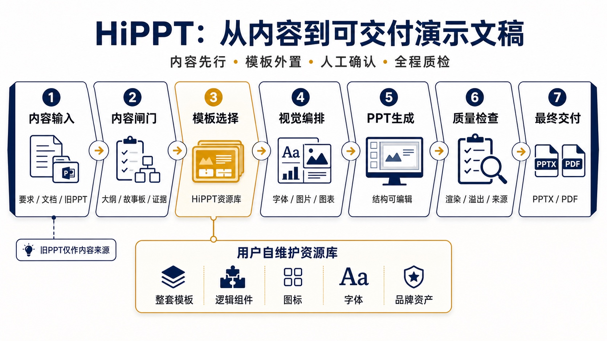

# HiPPT

HiPPT 是一个面向企业、医学和教学场景的跨平台 Agent Skill。它把“内容梳理、模板选择、字体与视觉设计、图片来源、医学证据边界、渲染检查和最终交付”组织成一套可重复执行的 PPT 工作流，可用于 Codex、Claude Code、WorkBuddy/CodeBuddy，以及其他支持 `SKILL.md` 的应用。

它不是一套固定模板，也不会自动附带第三方 PPT、字体或图片。每位使用者需要维护自己的模板资源库，并确保相关资产具备合法使用权限。



## 为什么需要 HiPPT

通用 AI 制作 PPT 时，经常出现这些问题：

- 直接沿用用户上传旧稿的母版和低质量版式；
- 未确认内容结构，就开始套模板；
- 字号过小、层级单一、页面密度失控；
- 反复使用三栏卡片、装饰圆点和随机渐变；
- 用虚构数据、假截图或无来源图片填补页面；
- 医学、法规和市场信息缺少证据状态与来源；
- 文件虽然生成成功，但没有经过逐页渲染和可编辑性检查。

HiPPT 通过内容闸门、模板资源库、场景化字体规范、视觉品味规则和发布前 QA，减少这些问题。

## 适用场景

- 售前方案与客户汇报；
- 产品介绍与公司内部汇报；
- 医学逻辑、病例教学和健康科普；
- 讲课、培训和说课竞赛；
- 将已有 PPT 的文字内容迁移到新模板；
- PPT 的结构优化、视觉重设计和质量检查。

## 核心原则

1. 用户上传的 PPT/PPTX 默认只作为内容来源，提取文字、讲稿、表格文字、图表数据或标签和引用信息。
2. 原稿的母版、版式、配色、字体、背景、装饰、图片和动画默认不继承。
3. 新设计模板从使用者维护的 HiPPT 模板资源库中选择。
4. 真实素材、官方资料和可核查网络图片优先；AI 生图仅用于适合的概念性或定制视觉。
5. 医学、法规、市场和公司数据区分已验证、用户提供、分析判断和证据缺口。
6. 标题、正文、图表、页码、来源和讲稿尽量保持可编辑。
7. 每次重要修改后重新检查结构、字体、溢出、渲染、来源和完整性。

## 三种制作模式

- 标准模式：先确认需求卡、大纲和逐页故事板，再推荐模板并制作。
- 快速模式：材料完整时直接制作样稿或整套，但不跳过证据、字体和 QA 闸门。
- 忠实迁移：保留原稿内容和顺序，仍使用 HiPPT 资源库中的新模板。

## 仓库结构

```text
hippt-public/
├── README.md
├── LICENSE
├── THIRD_PARTY_NOTICES.md
├── .gitignore
├── docs/
│   └── hippt-workflow.jpg
└── skills/
    └── hippt/
        ├── SKILL.md
        ├── agents/
        ├── assets/
        │   ├── config.json
        │   └── config.local.example.json
        ├── references/
        └── scripts/
```

模板、字体、品牌包和输出文件不应放入这个公开仓库。

## 兼容性与安装

HiPPT 遵循 [Agent Skills 开放规范](https://agentskills.io/specification)：技能目录以 `SKILL.md` 为入口，并使用相对路径引用 `scripts/`、`references/` 和 `assets/`。核心流程可以跨应用复用，但“能否直接读写、渲染和检查 PPTX”取决于宿主应用提供的工具，不能把格式兼容等同于能力完全一致。

### Codex

安装到个人技能目录：

```bash
mkdir -p ~/.codex/skills
cp -R skills/hippt ~/.codex/skills/hippt
```

调用示例：`用 $hippt 制作一份产品介绍。`

### Claude Code

Claude Code 原生识别个人目录 `~/.claude/skills/` 和项目目录 `.claude/skills/`。个人安装方式：

```bash
mkdir -p ~/.claude/skills
cp -R skills/hippt ~/.claude/skills/hippt
```

项目级共享方式：

```bash
mkdir -p .claude/skills
cp -R skills/hippt .claude/skills/hippt
```

可输入 `/hippt` 主动调用，也可以用自然语言让 Claude Code 自动匹配。详见 [Claude Code Skills 官方文档](https://code.claude.com/docs/en/slash-commands)。

### WorkBuddy 与 CodeBuddy

“WorkBuddy”存在桌面版、企业版和不同发布渠道，安装界面与本地目录可能不同：

- Tencent WorkBuddy 桌面端优先使用应用内的 SkillHub、技能管理或“导入 Skill”，导入整个 `skills/hippt` 目录；
- 如果客户端要求 ZIP，压缩时必须让 `SKILL.md` 直接位于 ZIP 根目录，不要多包一层 `hippt/`；
- WorkBuddy Enterprise/CodeBuddy 的项目级 Skill 目录为 `.codebuddy/skills/hippt/`，也可以通过设置界面导入；
- 安装后通过技能列表、自然语言或客户端提供的 `/hippt` 入口调用，不假设所有版本的交互方式完全一致。

相关说明见 [Tencent WorkBuddy](https://cloud.tencent.com.cn/product/workbuddy)、[WorkBuddy Enterprise Skills](https://cloud.tencent.com.cn/document/product/1831/134516) 和 [腾讯云 Skills 文件规范](https://cloud.tencent.com.cn/document/product/1759/134602)。

如需生成不进入 Git 的导入包：

```bash
mkdir -p dist
cd skills/hippt
zip -r ../../dist/hippt-skill.zip \
  SKILL.md scripts references assets \
  -x '*.DS_Store' '__pycache__/*' '*.pyc'
```

这个兼容包只包含 Agent Skills 标准目录，不包含 Codex 专用的 `agents/openai.yaml`。

### 其他 Agent 应用

把完整的 `skills/hippt` 文件夹放到该应用规定的 skills 目录，或通过其技能管理界面导入。至少确认：

- 应用能识别根目录中的 `SKILL.md`；
- 应用允许读取同目录下的 `references/`、`scripts/` 和 `assets/`；
- 可执行 Node.js 脚本，或者接受部分自动检查不可用；
- 具备 PPTX 读取、编辑和渲染工具，或能够调用 PowerPoint、LibreOffice 等外部工具。

### 能力降级规则

- 有原生 PPT/Slides 工具时优先使用原生能力；Codex 中可使用 `presentations`。
- 没有同名 `presentations`、网页搜索或生图工具，不代表 Skill 失效；HiPPT 会改用宿主应用实际具备的等价能力。
- 只有内容能力而没有 PPTX 编辑器时，可以完成需求卡、大纲、故事板和素材计划，但不能宣称已交付可编辑 PPTX。
- 无法逐页渲染时，文件只能标记为“未完成视觉验证”，不能标记为完整 PASS。
- `agents/openai.yaml` 只用于支持该元数据的客户端；其他应用可以安全忽略。

脚本使用 Node.js。完整预览渲染可能需要宿主应用的演示文稿工具；`@oai/artifact-tool` 是 Codex 可选适配器，macOS Quick Look 脚本仅适用于 macOS。

## 建立自己的模板资源库

### 1. 指定资源库位置

资源库放在公开 Git 仓库之外。由终端启动的应用可使用环境变量：

```bash
export HIPPT_ASSET_PACK_ROOT="/absolute/path/to/hippt-assets"
node skills/hippt/scripts/init-asset-pack.mjs "$HIPPT_ASSET_PACK_ROOT"
```

HiPPT 会优先读取 `HIPPT_ASSET_PACK_ROOT`。

部分桌面应用不会继承终端环境变量。这种情况下，把安装后 Skill 内的 `assets/config.local.example.json` 复制为 `assets/config.local.json`，再只修改本机资源库路径：

```json
{
  "asset_pack_root": "/absolute/path/to/hippt-assets"
}
```

`config.local.json` 已被 Git 忽略。不要把个人电脑的绝对路径写进公开的 `config.json`，也不要提交本地配置。

### 2. 资源库目录

```text
hippt-assets/
├── manifest.json
├── templates/                 # 可覆盖完整汇报流程的整套模板
├── components/                # 逻辑图、流程图和页面组件库
├── icons/                     # 图标型 PPT 或图标素材
├── previews/
│   └── covers/                # 模板封面预览
├── brand-packs/               # 经授权的公司或客户品牌资产
├── fonts/
│   ├── redistributable/       # 仅放允许再分发的字体
│   └── licenses/              # 字体完整许可证
└── catalogs/
    ├── templates.json
    ├── icons.json
    └── fonts.json
```

### 3. 添加和编目模板

资源库可由使用者长期自行维护。文件类型与目录的对应关系是：

- 可独立完成一整套演示的 PPTX 放入 `templates/`；
- 逻辑图、流程图和单页版式组件放入 `components/`；
- 图标型 PPTX 或图标素材放入 `icons/`；
- 模板封面图放入 `previews/covers/`；
- 公司或客户视觉资产放入 `brand-packs/`；
- 允许再分发的字体放入 `fonts/redistributable/`，许可证放入 `fonts/licenses/`。

推荐方式是从一个待导入目录批量复制并建立目录：

把自己拥有或获准使用的 PPTX 放在一个待导入目录，然后运行：

```bash
node skills/hippt/scripts/build-asset-catalog.mjs \
  "/absolute/path/to/your-template-source" \
  "$HIPPT_ASSET_PACK_ROOT" \
  --copy
```

脚本默认将普通 PPTX 识别为整套模板；路径中带有 `组件`、`component` 或 `逻辑图` 的文件识别为组件库；带有 `图标` 或 `icon` 的文件识别为图标库。

也可以直接把文件维护到上述对应文件夹。增删完成后，用原地编目模式刷新目录：

```bash
node skills/hippt/scripts/build-asset-catalog.mjs \
  "$HIPPT_ASSET_PACK_ROOT" \
  "$HIPPT_ASSET_PACK_ROOT" \
  --in-place
```

原地编目只扫描 `templates/`、`components/` 和 `icons/`，不会复制或覆盖模板文件。

自动生成的 `rights_status` 是“授权未核实”。使用者必须自行核对模板、字体、Logo、图片和品牌资产的许可，再更新资源记录。文件能够下载或购买，不等于允许公开再分发。

### 4. 生成预览并验证

macOS 可生成封面预览：

```bash
node skills/hippt/scripts/render-template-covers-quicklook.mjs \
  --asset-root "$HIPPT_ASSET_PACK_ROOT"
```

完成增删后运行验证：

```bash
node skills/hippt/scripts/verify-asset-pack.mjs "$HIPPT_ASSET_PACK_ROOT"
```

模板文件发生变化时，不要直接覆盖同名文件。保留新版本，重新生成目录和校验值，确认无误后再停用旧版本。

## 模板维护建议

- 整套模板必须至少具备封面、章节、普通内容、复杂信息和结束页。
- 逻辑组件和图标库不能伪装成整套模板候选。
- 为每个模板记录来源、版本、校验值、适用场景、字体风险和授权状态。
- 模板中的小字号不是必须继承的风格；内容应通过精简、拆页或换版式解决。
- 字体只有在许可证明确允许再分发时，才能进入公开资产包。
- 公司和客户品牌包应与通用模板分开管理。
- 不要把患者资料、客户机密、内部截图或未发布产品素材放入公共资源库。

## 使用示例

```text
用 $hippt 制作一份面向医院管理层的产品介绍，20分钟，先确认大纲。
```

Claude Code 可使用：

```text
/hippt 制作一份面向医院管理层的产品介绍，20分钟，先确认大纲。
```

```text
用 $hippt 将这份旧PPT的文字内容迁移到资源库中的新模板，不沿用原稿视觉。
```

```text
用 $hippt 忠实保留内容和顺序，直接制作三页样稿。
```

## 不包含的内容

本公开仓库不包含：

- 第三方 PPT 模板；
- 字体文件；
- 品牌 Logo 和客户资产；
- 用于 PPT 内容的网络图片或 AI 生成图片；README 工作流说明图除外；
- 示例患者资料和公司内部数据；
- 生成的 PPTX、PDF、预览图和工作文件。

## 隐私与医学内容

不要把患者可识别信息、医院内部数据或公司机密上传到外部搜索和生图服务。医学结论应区分已验证证据、用户提供材料、教学简化和分析判断。HiPPT 是制作与质量控制流程，不替代医学、法律或合规审核。

## 许可与致谢

HiPPT 核心代码和文档采用 MIT License。内容语言规则参考 Humanizer-zh，视觉规则参考 Taste Skill；两者均采用 MIT License。完整说明见 `THIRD_PARTY_NOTICES.md`。

模板、字体、图片和品牌资产拥有各自的许可，不因使用 HiPPT 而自动获得再分发权。
